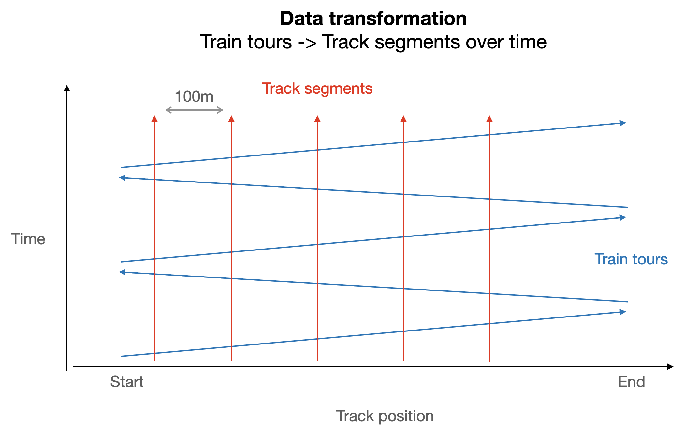
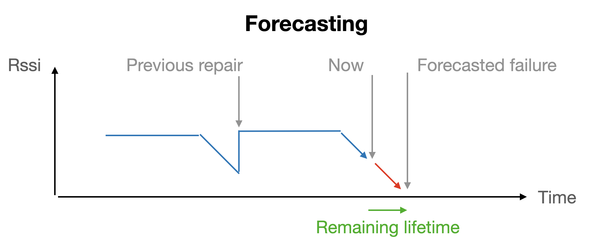

This analysis is based on the challenge of [SIEMENS](https://www.mobility.siemens.com/ch/en.html) at [HackZurich 2021](https://hackzurich.com). With the callenge, data from one of their train-communication-systems was provided. The task was to detect, predict and categorize failures. See the [challenge documentation](https://github.com/croidzen/hz21-sc/blob/main/challenge_documentation/Workshop_Siemens_Mobility_20210924.pdf) for further information of the challenge.

Our team's approach was to transform the provided data from train-based to track-based and then build a predictive maintenance model for the degradation-based e-stops.

 
 

The original hackathon code can be found [here](https://github.com/Noorts/hz21-sc) and [here](https://github.com/SanjoyPator1/HackZurichBackend), this repo contains an analysis done afterwards.